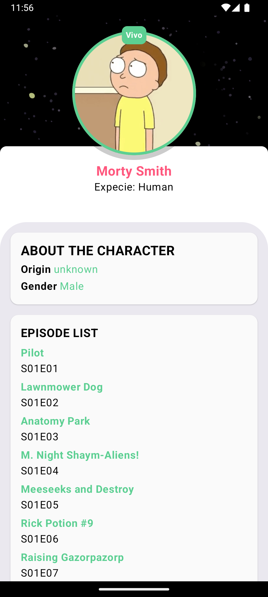
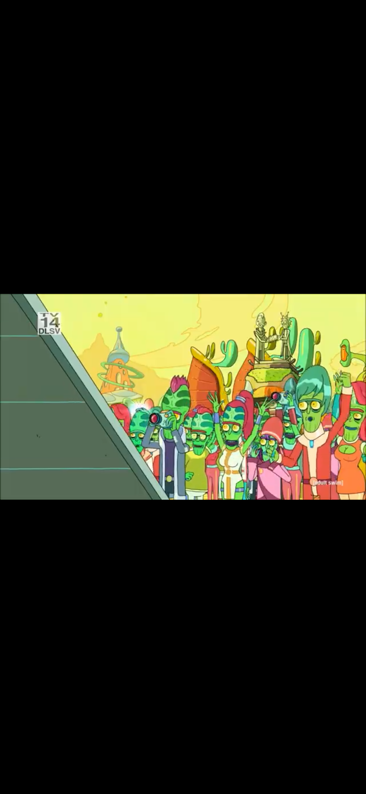
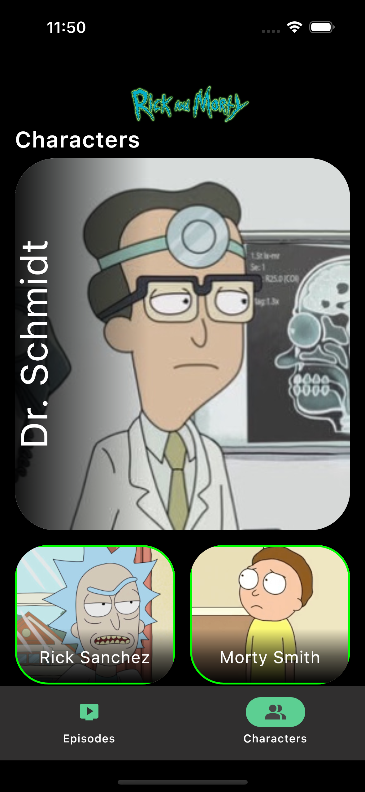
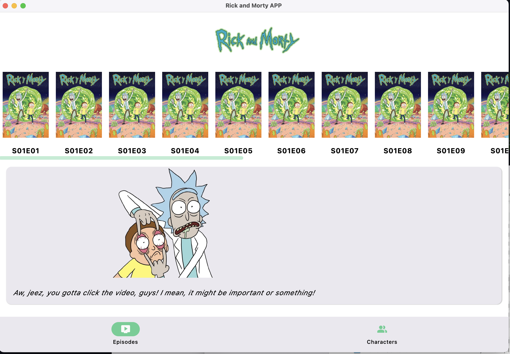
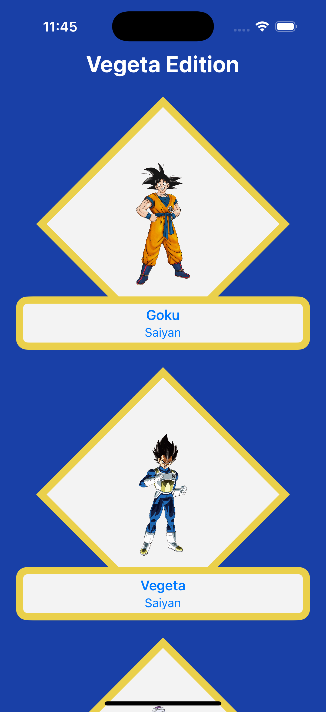

# Preview

<!-- Projecte 1 – Android -->

  
  
  

<!-- Projecte 1 – iOS -->

  
  
  
  
  

<!-- Projecte 1 – Desktop -->

  
  
  

<!-- Projecte 2 – Android -->

  
  

<!-- Projecte 2 – iOS -->

  
  

